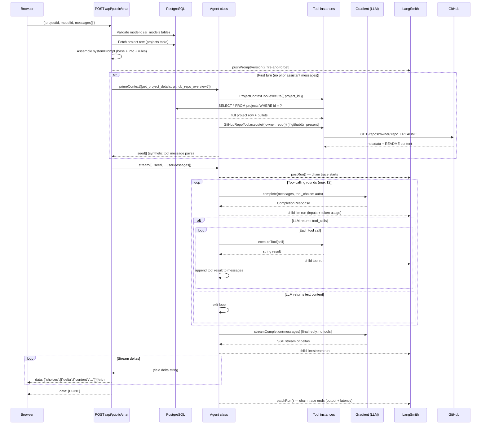
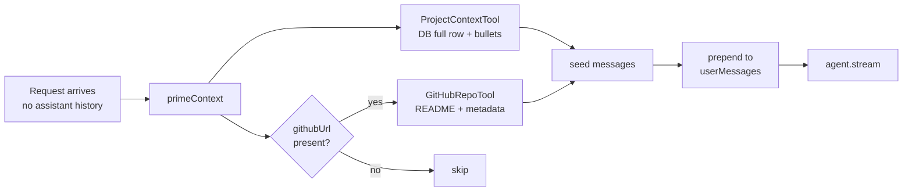
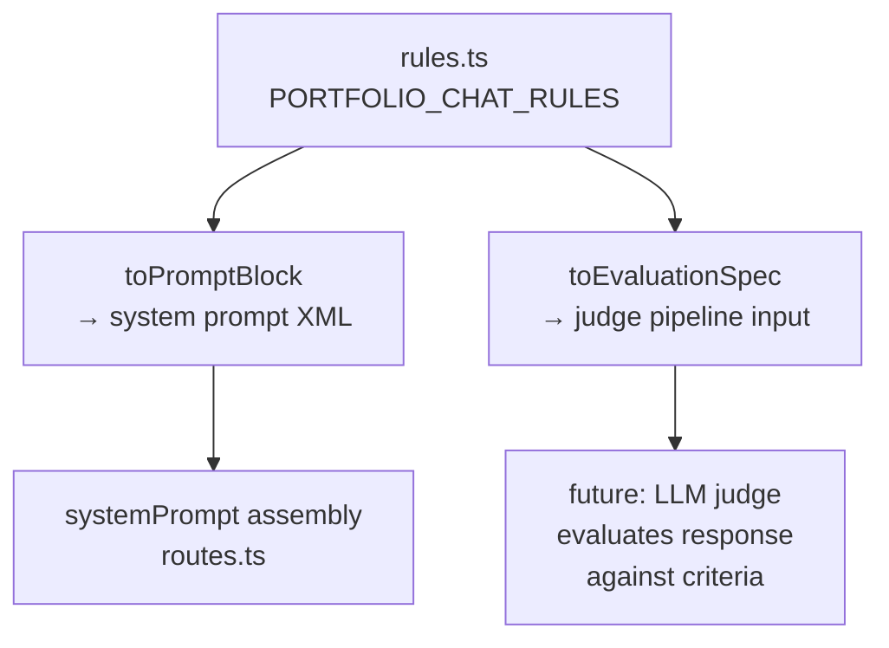

# Portfolio Chat Agent — Architecture & Flow

A per-request agentic loop that serves as a conversational interface for portfolio projects. Built on DigitalOcean Gradient (OpenAI-compatible), traced in LangSmith, and governed by a structured ruleset.

---

## System Prompt Assembly

The final system prompt is assembled on every request from three independent layers, then versioned to LangSmith Hub.

```
basePrompt          (DB column: projects.ai_system_prompt, or auto-generated fallback)
  + generalInformation   (owner contact info, background — TODO: pull from personal_information table)
  + rules.toPromptBlock()  (rendered from PORTFOLIO_CHAT_RULES in rules.ts)
         │
         └──► pushPromptVersion()  ──► LangSmith Hub (versioned, one prompt per project ID)
```

**Where to edit each layer:**

| Layer | File | How |
|-------|------|-----|
| Base persona / project framing | `server/routes.ts:282` or `projects.ai_system_prompt` in DB | Per-project override via admin panel |
| Owner info | `server/routes.ts:280` | Hardcoded (TODO: DB pull) |
| Behavioral rules | `server/agent/rules.ts` | Add/modify `Rule` objects in `PORTFOLIO_CHAT_RULES` |

---

## Request Lifecycle



---

## Context Priming (First Turn)

On every first message (no prior assistant turns), the server pre-executes tools and injects the results as synthetic message pairs **before** the LLM sees any user input. This guarantees the model has verified context without depending on it deciding to call tools.



The injected seed looks like:

```
assistant  →  tool_calls: [{ name: "get_project_details", args: { project_id: "..." } }]
tool       →  { id, title, description, longDescription, tech, githubUrl, bullets, ... }
assistant  →  tool_calls: [{ name: "github_repo_overview", args: { owner, repo } }]
tool       →  { full_name, description, language, stars, readme, ... }
user       →  "can you explain the architecture?"
```

---

## Tool Roster

| Tool | Name | Purpose |
|------|------|---------|
| `ProjectContextTool` | `get_project_details` | Full DB project row + bullets. Always pre-executed on turn 1. |
| `GitHubRepoTool` | `github_repo_overview` | README + repo metadata. Pre-executed on turn 1 if `githubUrl` present. |
| `GitHubFileTreeTool` | `github_file_tree` | List files/dirs at any path. Use to explore structure. |
| `GitHubReadFileTool` | `github_read_file` | Read a specific file (6k char cap). For verified source quotes. |
| `GitHubCommitsTool` | `github_commits` | Recent commits, optionally filtered to a file. |
| `GitHubIssuestool` | `github_issues` | Open/closed issues and pull requests. |

---

## Ruleset Architecture

Rules are structured objects in `rules.ts`, not prompt strings. Each carries:

```ts
interface Rule {
  id: string;             // stable — used by LLM judge to reference violations
  category: string;       // "formatting" | "conduct" | "tools"
  instruction: string;    // injected into system prompt via toPromptBlock()
  evaluationCriteria: string; // used by future LLM-judge evaluator
  severity: "critical" | "major" | "minor";
}
```

`Ruleset.toPromptBlock()` renders them into a `<rules>` XML block grouped by category.
`Ruleset.toEvaluationSpec()` exports the machine-readable form for judge pipelines.



---

## Observability

Every conversation is a RunTree in LangSmith:

```
agent:openai-gpt-oss-120b              [chain]   tags: ["project-chat", modelId, projectTitle]
├── openai-gpt-oss-120b                [llm]     tool-calling probe round 1
│   └── (tool_calls returned)
├── get_project_details                [tool]
├── github_repo_overview               [tool]
├── openai-gpt-oss-120b                [llm]     tool-calling probe round 2 (if needed)
└── openai-gpt-oss-120b:stream         [llm]     final streaming reply
```

System prompts are versioned per-project in LangSmith Hub under `project-{id}-system`. Every change to the DB `ai_system_prompt` column or to `rules.ts` produces a new commit.
